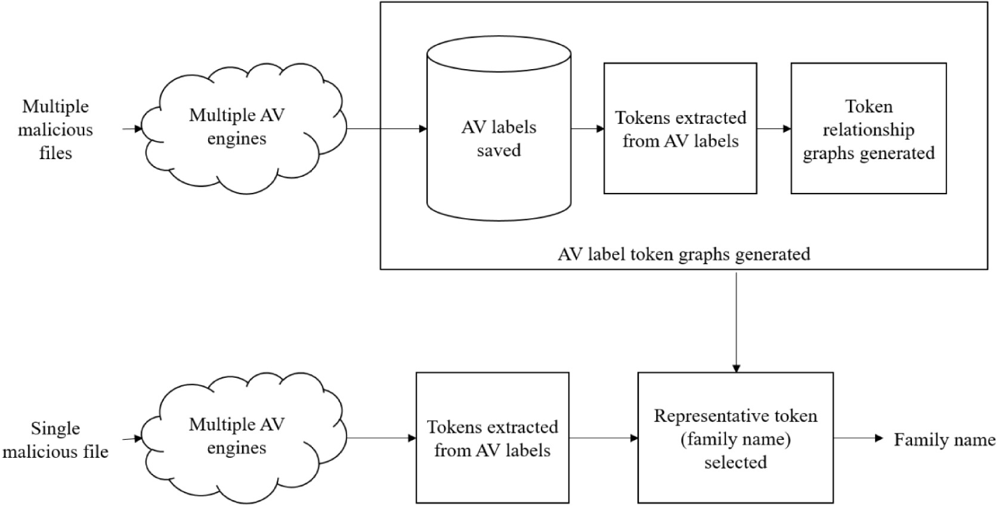

# Sumav
Sumav is a fully automated labeling tool that assigns each file a family name based on AV labels.
Creates a relationship graph between AV label tokens through VirusTotal file feed (similar to ML training), and then infers family name from AV label for one input file (similar to ML serving).



# Quickstart with docker-compose
We assume that you already have [docker-compose](https://docs.docker.com/compose/install/) installed.
> NOTICE: We provide a sql file of pregenerated Suamv graph for a quick start, but for the best performance, you should update Sumav graph periodically.
```
$ git clone https://github.com/bestksw/sumav.git
$ cd sumav
$ zip -F sumav_paper_graph.zip --out full-archive.zip && unzip full-archive.zip && rm full-archive.zip
$ docker-compose up -d --no-build
$ docker exec -it sumav_sumav_1 sumav run select '["PUP/Win32.Dealply.C3316715", "Win32:DealPly-AJ [Adw]", "a variant of Win32/DealPly.RC potentially unwanted", null]'
dealply
```

# Install
## Prerequsite
- Above Python 3.5 with Ubuntu 16.04
- Above PostgreSQL 11 server and clients

Tested on PostgreSQL 11.1 and Python 3.8 with Ubuntu 20.04 Desktop

## pip install
```
pip3 install sumav
```

# How to use
You should build your own graph from VT filefeed/apiv2 before run Sumav.

## Create graph
### CMD
```
$ sumav
usage: sumav [-h] [-l {n,c,e,w,i,d}] [-v] [-s] {build,migrate,run} ...

positional arguments:
  {build,migrate,run}   command to run

optional arguments:
  -h, --help            show this help message and exit
  -l {n,c,e,w,i,d}, --logging_level {n,c,e,w,i,d}
                        n:none, c:critical, e:error, w:warn, i:info, d:debug
  -v, --version         show program's version number and exit
  -s, --show-config     show configs came from environment variables. (refer
                        to /home/bestksw/workspace_sumav/Sumav/sumav/conf.py)
...

$ sumav build
usage: sumav build [-h] [-p] {vt,none} ...

positional arguments:
  {vt,none}             preprocess data from
    vt                  virustotal
    none                skip preprocess

optional arguments:
  -h, --help            show this help message and exit
  -p, --preprocess-only
  
$ PSQL_HOST=172.31.10.10 PSQL_DB=sumav_exp sumav build vt /srv/vt_file_feed  # Takes one day per a month of data
...

$ PSQL_HOST=172.31.10.10 PSQL_DB=sumav_exp sumav run 
usage: sumav run [-h] {select,compare,similar} ...

positional arguments:
  {select,compare,similar}
                        query methods

optional arguments:
  -h, --help            show this help message and exit

$ sumav run select '["PUP/Win32.Dealply.C3316715", "Win32:DealPly-AJ [Adw]", "a variant of Win32/DealPly.RC potentially unwanted", null]'
dealply
```
### API
```python
$ PSQL_HOST=172.31.10.10 PSQL_DB=sumav_exp python3
>>> import sumav
>>> from sumav.conf import get_conf, psql_conf
>>> help(sumav)  # API documentation
>>> get_conf()   # Can see configuration
...
>>> # Convert VT file feed to Sumav DB
>>> from_vt = FromVT(**psql_conf)
>>> from_vt.convert('/srv/vt_file_feed')
...
>>> from_vt.close() # Close connection
>>> # Build graph
>>> builder = SumavGraphBuilder(**psql_conf)
>>> builder.build_graph(processes=30, skip_build_token_node=False)
...
>>> builder.close() # Close connection
```
## Run Sumav
```python
$ PSQL_HOST=172.31.10.10 PSQL_DB=sumav_exp python3
>>> import sumav
>>> from sumav.conf import get_conf, psql_conf
>>> get_conf()   # Can see configuration
...
>>> # If you want to designate dumped graph, execute below line
>>> # psql_conf['database'] = 'sumav_srv_200101-200601'
>>> searcher = sumav.SumavGraphSearcher(**psql_conf)
>>> # searcher.load_dumped_graph()  # Automatically load dumped graph came from remote
>>> dn = ['PUP/Win32.Dealply.C3316715', 'Win32:DealPly-AJ [Adw]',
          'a variant of Win32/DealPly.RC potentially unwanted',
          None, 'DealPly Updater (PUA)', None, None]
>>> searcher.get_representative_token(av_labels=dn)
dealply
```

# License
Apache 2.0
\+ You must notify "Sumav is used" in your project even if only its outputs are used.

# Paper
Kim, Sangwon, et al. "Sumav: Fully automated malware labeling." ICT Express (2022).
[Download pdf](https://reader.elsevier.com/reader/sd/pii/S2405959522000285?token=A8126AF7B95878CAA703DC9B86151A9369C80A7C1CFF36FFC3CD42D00AF37164D283F7FFF71B7B8D0034673EB245EB41&originRegion=us-east-1&originCreation=20220316000335)

Kim, Sangwon, et al. "Sumav: A Scheme for Selecting a Keyword from Detection Names using Conditional Probability."  _2020 International Conference on Information and Communication Technology Convergence (ICTC)_. IEEE, 2020.
[Download pdf](https://ieeexplore.ieee.org/stamp/stamp.jsp?arnumber=9289189)

# Patent
[KR102199704B1](https://patents.google.com/patent/KR102199704B1/en)

[US11,232,200B2](https://patft.uspto.gov/netacgi/nph-Parser?Sect1=PTO1&Sect2=HITOFF&d=PALL&p=1&u=%2Fnetahtml%2FPTO%2Fsrchnum.htm&r=1&f=G&l=50&s1=11,232,200.PN.&OS=PN/11,232,200&RS=PN/11,232,200)

# Authors
- Sangwon Kim
- Wookhyun Jung
- Eltak Kim
